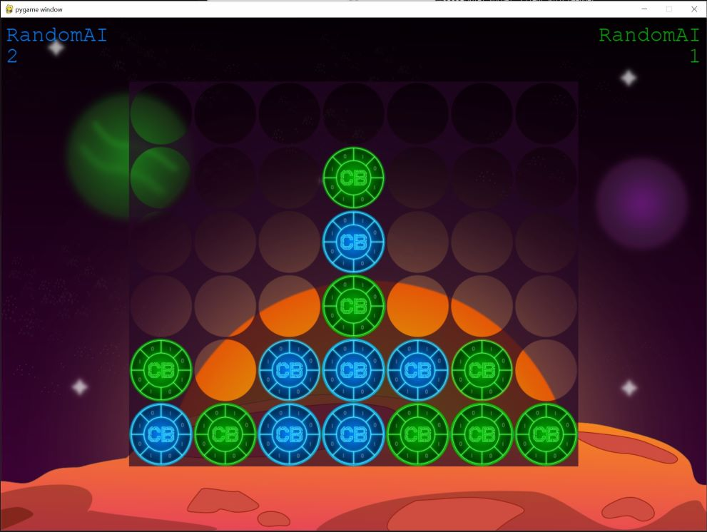
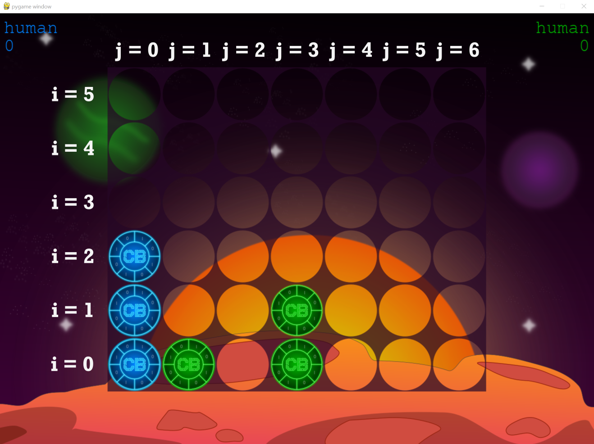

# Willkommen zum KI Wettbewerb "4 Gewinnt" von den Coding Buddies!

Zum krönenden Abschluss unseres Grundlagenkurses veranstalten wir einen KI Wettbewerb zu dem Klassiker "4 Gewinnt".
Nutzt euer erlangtes Wissen aus dem Kurs und tretet gegen andere Entwickler in einem spaßigen Turnier im KO Modus an!

**Grundsätzlich gilt:**

Solltet ihr Fragen haben oder Hilfe benötigen. Scheut euch nicht uns auf unseren Plattformen zu kontaktieren! Wir werden
auch verschiedene Starthilfen zur Verfügung stellen.

<br>



## Aufgabe

Es ist ein **Bot** zu entwickeln, der nach den **Standardregeln** das Spiel "4 Gewinnt" spielt. Hierfür haben wir eine
Schnittstelle in den jeweiligen Clients (Java oder Python) bereit gestellt, welche implementiert werden muss. Das Ziel
ist es eine gewisse Anzahl an Spiele gegen eine Gegner KI zu gewinnen und als Turniersieger hervorzugehen! :)

## Teilnahmebedingungen

- Implementierung der vorgegebenen Bot Schnittstelle (Java oder Python)
- Der Bot sendet dem Spiel vor dem Timeout (ca 2 Sekunden), was der nächste Zug ist
- Die KI ist selbst geschrieben

## Anforderungen

- Python 3.10.4+ (für den Spieleserver und gegebenfalls für den Bot)
- Java SDK 17+  (falls der Bot in Java geschrieben wird)

## Den Spieleserver starten

Den Spieleserver startest du wie folgt:

```  
cd gameServer
py __main__.py
``` 

Hierfür wird default der Port 8765 verwendet. Falls du beispielsweise den Port 5555 
verwenden möchtest, ändere den Aufruf zu:

```  
py __main__.py 5555
```

Es sollte als letzte Nachricht zu sehen sein:

```  
start game server..
```

Der Server ist erfolgreich gestartet und die Clients können sich verbinden.
Sobald sich zwei Clients verbunden haben, beginnt das Spiel.

## Einen Client mit dem Server verbinden (Python)

Den Python Client starten:

```  
cd pythonClient
py clientMain.py <BotName> <Port>
``` 

| Parameter | Beschreibung                                             |
|-----------|----------------------------------------------------------|
| BotName   | Name der KI, die gestartet werden soll (default: random) |
| Port      | Port des Servers (default: 8765)                         |

Möchtest du beispielsweise die Fill KI starten und der Server läuft auf 5555:

```  
py clientMain.py fill 5555
```

## Einen Client mit dem Server verbinden (Java)

Den Java Client starten:

```  
cd javaClient   # in den javaClient Ordner wechseln
gradlew run
```

Um einen anderen Port oder eine andere KI zu verwenden:

```  
gradlew run --args="<BotName <Port>"
``` 

| Parameter | Beschreibung                                             |
|-----------|----------------------------------------------------------|
| BotName   | Name der KI, die gestartet werden soll (default: random) |
| Port      | Port des Servers (default: 8765)                         |

Möchtest du beispielsweise deine eigene KI starten und der Server läuft auf 5555:

```  
gradlew run --args="user 5555"
``` 

## Die Botklasse

Um eine Eigene KI in das Spiel zu integrieren, muss eine vorgegebene BotKlasse implmenetiert werden.
Dafür muss die play() Methode/Funktion ergänzt werden.

Die Botklasse kann wahlweise in Java oder Python entwickelt werden:

### Python

Unter dem Pfad "Bots" findest du das user_ai.py file.
Diese Klasse beinhaltet die user KI und die folgende Funktion "play":

```
    def play(self, current_field):
        #
        # Implementiere hier deine Logik, damit die KI spielen kann
        #
        return 0  # aktuell wird immer die erste Spalte ausgewählt als nächsten Zug
```

Der Returnwert der play Funktion ist ein Integer innerhalb von 0-5 (mögliche Spalten im Spielfeld)

### Java

Unter dem Package "bots" findest du das UserBot.java file.
Diese Klasse beinhaltet die user KI und die folgende Funktion "play":

```
    public int play(int[][] field) {
        /*
        Implementiere hier deine Logik, damit die KI spielen kann
         */
        return 0; // aktuell wird immer die erste Spalte ausgewählt als nächsten Zug
    }
```

Der Returnwert der play Funktion ist ein Integer innerhalb von 0-5 (mögliche Spalten im Spielfeld)

### Übersicht der aktuellen Bots

| Bot    | Beschreibung                           |
|--------|----------------------------------------|
| random | wählt zufällig eine nächste Spalte aus |
| fill   | füllt eine konfigurierte Spalte auf    |
| user | verwendet deine eigene KI              |

## Spielfeld Daten

Die aktuellen Spielfelddaten werden deiner KI pro Spielzug zur Verfügung gestellt.
Damit hast du die alle notwendigen Informationen und entsprechend "den Blick" auf das Spielfeld.

Die Variable "current_field" ist ein zweidimensionales Array, welches das Spielfeld beschreibt.

**Beispiel aktuelles Spielbrett der Variable "current_field [i] [j]":**
```  
       j=0   j=1   j=2   j=3   j=4   j=5   j=6 
i=0: [  1  ,  2  ,  0  ,  2  ,  0  ,  0  ,  0  ]
i=1: [  1  ,  0  ,  0  ,  2  ,  0  ,  0  ,  0  ]
i=2: [  1  ,  0  ,  0  ,  0  ,  0  ,  0  ,  0  ]
i=3: [  0  ,  0  ,  0  ,  0  ,  0  ,  0  ,  0  ]
i=4: [  0  ,  0  ,  0  ,  0  ,  0  ,  0  ,  0  ]
i=5: [  0  ,  0  ,  0  ,  0  ,  0  ,  0  ,  0  ]
```  

**Spieler 1 (Blau) hat die ID=1**

**Spieler 2 (Grün) hat die ID=2**

Um das Spiel zu gewinnen, muss die KI von Spieler 1 als nächsten Zug 
die erste Spalte auswählen/zurückgeben

**Die oben gezeigten Daten passen zu dem folgenden Bild:**

<br>


